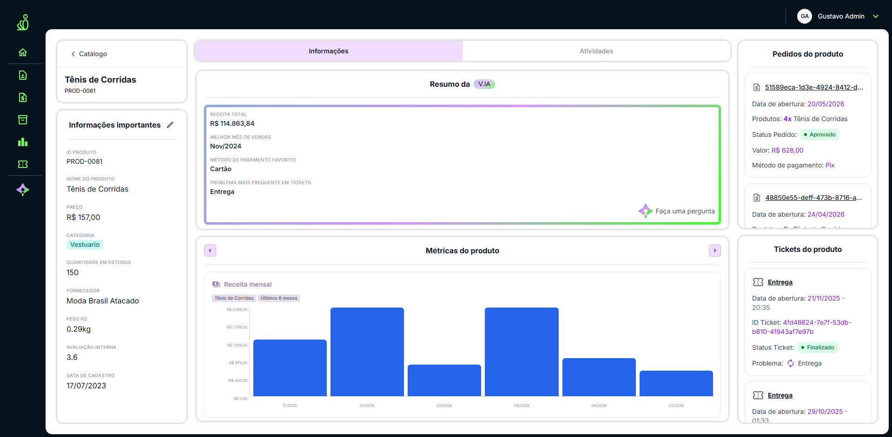

# Produto Específico

## Visão Geral

Página de detalhe de um produto individual. Exibe todas as informações cadastrais, métricas históricas (receita, NPS, volume de vendas), pedidos vinculados, tickets de suporte e log de atividades. Permite editar e excluir o produto diretamente da tela.

**Rota:** `/products/:id`  
**Arquivo:** `src/Pages/Products/ProductDetail.tsx`

---

## Componentes utilizados

| Componente | Arquivo | Descrição |
|---|---|---|
| `ProductEditModal` | `Pages/Products/ProductEditModal.tsx` | Modal de edição/exclusão do produto (Dialog Radix) |
| `ProductResumoCard` | `Pages/Products/ProductResumoCard.tsx` | Card de resumo gerado pela V.IA com métricas derivadas |
| `CustomScrollArea` | `components/atoms/CustomScrollArea` | Scroll interno nos painéis de pedidos, tickets e atividades |

---

## Layout

A tela é dividida em **3 colunas fixas**:



<details>
<summary>Versão texto do layout (caso a imagem não carregue)</summary>

```
┌─────────────────┬───────────────────────────┬──────────────────┐
│ Painel Esquerdo │      Painel Central       │ Painel Direito   │
│    (280px)      │          (1fr)            │    (300px)       │
│                 │                           │                  │
│ • Card cabeçalho│ • Tabs (Informações /     │ Tab Informações: │
│   (← Catálogo + │         Atividades)       │  • Pedidos       │
│   nome/ID)      │                           │  • Tickets       │
│                 │ Tab Informações:          │                  │
│ • Card Infos    │  • Resumo V.IA            │ Tab Atividades:  │
│   importantes   │  • Métricas (carrossel)   │  • Log de        │
│   (campos +     │                           │    atividades    │
│   botão editar) │ Tab Atividades:           │                  │
│                 │  • Pedidos                │                  │
│                 │  • Tickets                │                  │
└─────────────────┴───────────────────────────┴──────────────────┘
```

</details>

---

## Chamadas de API

| Método | Endpoint | Estado | Quando |
|---|---|---|---|
| `GET` | `/products/{id}` | `product` | Montagem da página |
| `GET` | `/products/{id}/orders` | `orders` | Montagem da página |
| `GET` | `/products/{id}/tickets` | `tickets` | Montagem da página |
| `GET` | `/products/{id}/monthly-revenue` | `revenue` | Montagem da página |
| `GET` | `/products/{id}/activities` | `activities` | Montagem + após edição |
| `GET` | `/products/{id}/monthly-nps` | `npsData` | Montagem (falha silenciosa) |
| `GET` | `/products/{id}/monthly-sales` | `salesData` | Montagem (falha silenciosa) |
| `PUT` | `/products/{id}` | — | Ao salvar no `ProductEditModal` |
| `DELETE` | `/products/{id}` | — | Ao excluir no `ProductEditModal` |

> As 5 primeiras chamadas rodam em `Promise.all`. NPS e vendas mensais rodam separadas — uma falha não bloqueia o restante da página.

---

## Estados gerenciados

| Estado | Tipo | Descrição |
|---|---|---|
| `product` | `Product \| null` | Dados base do produto |
| `orders` | `ProductOrder[]` | Pedidos vinculados ao produto |
| `tickets` | `ProductTicket[]` | Tickets de suporte vinculados |
| `revenue` | `MonthlyRevenue[]` | Receita mensal (últimos meses) |
| `npsData` | `MonthlyNps[]` | NPS médio mensal |
| `salesData` | `MonthlySales[]` | Quantidade vendida por mês |
| `activities` | `ProductActivity[]` | Log de alterações do produto |
| `loading` | `boolean` | Exibe estado de carregamento |
| `error` | `boolean` | Exibe mensagem de produto não encontrado |
| `tab` | `"informacoes" \| "atividades"` | Controla a tab ativa no painel central |
| `chartIndex` | `0 \| 1 \| 2` | Qual gráfico exibir no carrossel de métricas |
| `editOpen` | `boolean` | Abre/fecha o `ProductEditModal` |
| `idCopied` | `boolean` | Controla a visibilidade do toast de cópia do ID |

---

## Sub-componentes internos

| Componente | Descrição |
|---|---|
| `InfoRow` | Label cinza uppercase + valor — usado no card "Informações importantes" |
| `StatusBadge` | Badge de status do pedido; cor mapeada por `STATUS_COLORS` |
| `RevenueChart` | Gráfico de barras da receita mensal (últimos 6 meses) |
| `NpsChart` | Gráfico de barras do NPS médio (escala fixa 0–10) |
| `MonthlySalesChart` | Gráfico de barras do volume de vendas mensal |

> Os 3 gráficos são implementados manualmente com `div`s posicionadas — sem biblioteca externa.

---

## Mapas de cor

### `CATEGORY_COLORS`
Badge de categoria no card "Informações importantes".

| Categoria | Cor |
|---|---|
| Automotivo | slate |
| Beleza | pink |
| Brinquedos | violet |
| Casa | amber |
| Eletronicos | blue |
| Esportes | green |
| Moveis | orange |
| Vestuario | teal |
| Indefinida | gray |

### `STATUS_COLORS`
Badge de status nos cards de pedidos.

| Status | Cor |
|---|---|
| Aprovado / Sucesso | green |
| Cancelado | red |
| Reembolsado | yellow |
| Pendente | gray |

---

## Interações e comportamentos

| Ação | Comportamento |
|---|---|
| Botão `← Catálogo` | Navega para `/products` |
| Clicar no ID do produto | Copia o ID para o clipboard e exibe toast verde por 2 segundos |
| Botão de edição (lápis) | Abre `ProductEditModal`; fica com fundo `#EACAFF` enquanto o modal está aberto |
| Salvar no modal de edição | Atualiza `product` no estado e recarrega `activities` via API |
| Excluir no modal de edição | Navega para `/products` após exclusão |
| Trocar de tab | Alterna entre "Informações" e "Atividades" no painel central e direito simultaneamente |
| Botões `‹` / `›` nas métricas | Navega entre os 3 gráficos do carrossel (`chartIndex` 0→1→2) |
| Botão "Faça uma pergunta" | Dispara o evento customizado `open-ai-chat` com contexto do produto para abrir o chat da V.IA |

---

## Dados derivados (calculados localmente)

Estes valores são calculados a partir dos dados já carregados — sem chamada extra à API — e passados ao `ProductResumoCard`:

| Campo | Cálculo |
|---|---|
| `receita_total` | Soma de todos os valores em `revenue` |
| `melhor_mes` | Mês com maior `receita` em `revenue` |
| `metodo_pagamento_favorito` | Método mais frequente em `orders` |
| `problema_mais_frequente` | Tipo de problema mais frequente em `tickets` |

---

## Observações

- O badge de status dos tickets usa lógica booleana (`t.resolvido`): `true` → "Finalizado" (verde), `false` → "Em aberto" (amarelo).
- Os cards de pedidos e tickets aparecem tanto no painel central (tab "Atividades") quanto no painel direito (tab "Informações") — são o mesmo dado renderizado em dois locais.
- O `ProductEditModal` só é disponível para usuários com permissão de edição (`useAuth`).
- A página não tem paginação — todos os pedidos, tickets e atividades são carregados de uma vez.
